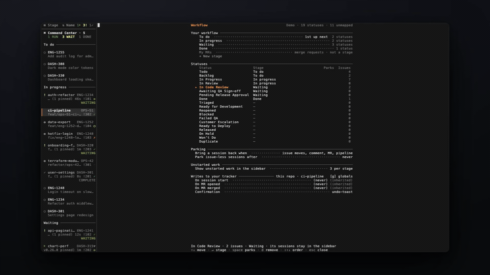
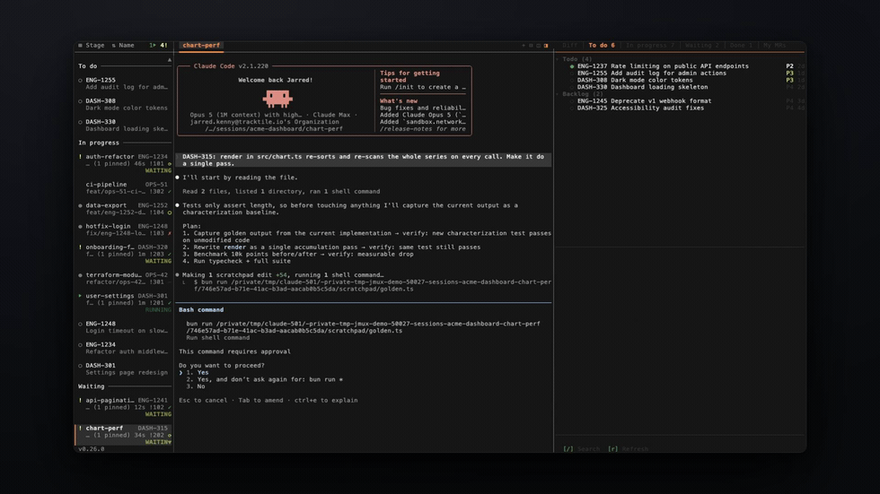
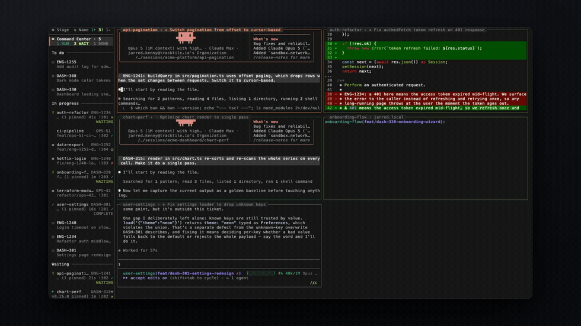

<div align="center">


# jmux

### From ticket to shipped feature, in the terminal you already use.

Define the workflow stages you actually think in, then run your whole backlog through a fleet of coding agents on them — Claude Code, Codex, or any agent, each in its own isolated session. jmux shows you who's working, who finished, and who's blocked on you. **You're still the pilot.**

[](https://www.npmjs.com/package/@jx0/jmux)
[](LICENSE)


```bash
curl -fsSL https://jmux.build/install | sh && jmux
```

**[▶ Watch the walkthrough](https://jmux.build/#demo)** — real agents, nothing staged.

**Ticket in, MR out** — [Linear](https://linear.app) · [GitHub](https://github.com) · [GitLab](https://about.gitlab.com), self-hosted GitLab and GitHub Enterprise included.

</div>

## Get running

- **Install** — the command above needs no runtime; it installs a self-contained
  binary. Also on Homebrew (`brew install jarredkenny/tap/jmux`) and npm
  (`bun install -g @jx0/jmux`, which needs [Bun](https://bun.sh) 1.3.8+ and is
  the only option on Alpine/musl).
- **Requirements** — [tmux](https://github.com/tmux/tmux) 3.2+. jmux offers to install it on first run.
- **Just want to look around?** `jmux --demo` runs with mock data — explore every feature, no credentials needed.
- **New to tmux?** Start with the **[Getting Started guide](docs/getting-started.md)**.

---

## Features

### Define your own workflow

Your tracker has a lot of statuses — `Ready for Development`, `Awaiting QA Sign-off`, `Pending Release Approval` — most of them named for someone else's process. You don't think in 25 states. You think in five.

So jmux has you define **your own workflow stages** and sit each one on top of one or many of your tracker's statuses:

```
Urgent       ──  Customer Escalation, Failed QA
To do        ──  Ready for Development, Triaged
In Progress  ──  In Progress, Reopened
Waiting      ──  In Code Review, Awaiting QA Sign-off, Pending Release Approval, …
Done         ──  Released
```

A stage shows up as a tab in the info panel, but that's how it *appears*, not what it *is* — it's one rung on the ladder you actually work by, and its place in the list is its priority. Every status then has exactly two settings: **which stage it belongs to**, and **whether it parks**.

That second one is what keeps a fleet manageable:

- **Park what you've handed off.** A teammate has it in review, QA has it, it's blocked on someone else — that session collapses into a single `Parked (n)` row at the bottom of the sidebar. Nothing is killed: the session, its worktree and its scrollback are untouched.
- **Parking reverses itself.** The issue moves, someone comments, the MR is touched, a pipeline goes red, or the agent wants you — it comes straight back out, flagged. That's what makes it safe to trust.



- **See what you haven't started.** Each stage can show the work sitting in it that nobody has picked up — issues with no session — as dimmed rows right under the sessions that do. Click one and it becomes real: worktree, session, agent, issue linked. The sidebar stops being a list of what's running and becomes the whole board.
- **Pull the next thing** with `Ctrl-a u`. It takes the top item from your first non-empty stage and does the whole ticket-to-worktree-to-agent dance. The daily ritual is one keystroke.
- **Capture without losing your place** — `Ctrl-a a` files a Linear issue from wherever you are. `Enter` files it and returns you; `Ctrl-S` files it *and* starts work on it.
- **Status updates as a byproduct.** Optionally move an issue along when you start a session on it, when an MR appears on its branch, and when that MR merges — with `TRA-123 → QA  ^a Z undo` in the toolbar for twenty seconds. All of it defaults to off: **jmux never writes to your tracker until you say so.**

<details>
<summary><b>Setup</b> — one screen, <code>Ctrl-a W</code></summary>

Everything above is configured on one screen. It's two blocks: your panel tabs, then a table of every status your tracker offers.

```
Workflow                             Linear · 25 statuses · 8 unmapped

  Your workflow ──────────────────────────────────────────────────────
    Urgent ··································· 1st up next  2 statuses
    To do ···································· 2nd up next  3 statuses
    In Progress ··········································· 3 statuses
    Waiting ···························· no unstarted  ⏸ 8  8 statuses
    Done ············································ hidden  1 status
    + New stage

  Statuses ───────────────────────────────────────────────────────────
    Status                     Stage                     Parks  Issues
    Customer Escalation        Urgent                                2
    Ready for Development      To do                                 5
    In Code Review             Waiting                   ⏸           7
    Awaiting QA Sign-off       Waiting                   ⏸          19
    Backlog                    —                                     5

  Unstarted work ─────────────────────────────────────────────────────
    Show unstarted work in the sidebar ··············· ◂ 3 per stage ▸

  Awaiting QA Sign-off · 19 issues · Waiting · parks its sessions (3 now)
  ↑↓ move · ↵ stage · space parks · d remove · ⇧↑↓ order · esc close
```

Two blocks: your stages, then a table of every status your tracker offers. Each status has exactly two settings — which stage it belongs to (`Enter`) and whether it parks (`space`) — and they're independent, so a status can park while belonging to no stage at all. The line above the keys tells you what the selected row will actually do, including when it will do nothing.

Each **stage** carries two more: `s` shows or hides it in the sidebar, `space` shows or hides its unstarted work there. A row only mentions either when it's off its default, which is why most say nothing. Hiding a stage hides its heading, never its sessions — those fall to the flat list at the bottom, because no setting here should be able to make an agent that's waiting on you disappear.

Full guide: [docs/workflow.md](docs/workflow.md).
</details>

### From ticket to merged, without leaving the terminal

Connect [Linear](https://linear.app) and [GitLab](https://about.gitlab.com) or [GitHub](https://github.com) — [five minutes, one page](docs/connecting.md) — open the info panel with `Ctrl-a g`, and the whole loop lives in your terminal:

**Pick an issue → press `n` → jmux creates a worktree, opens a session, and launches your agent with the issue context.** One keystroke from ticket to working code.



While it works, watch the sidebar. When it finishes, toggle the **integrated diff panel** to review the changes side-by-side with the agent's output.


Then flip to the **MRs tab** — approve or update status without opening a browser. `o` opens anything in your browser, `s` updates an issue's status, `a` approves, `r` refreshes from the tracker.

Each agent gets its own isolated branch via **[wtm](https://github.com/jarredkenny/worktree-manager)** — no stashing, no conflicts, no switching. `Ctrl-a n` → pick a project → **+ new worktree**.

<details>
<summary><b>Setup</b> — Linear + GitLab / GitHub / GitHub Enterprise</summary>

```jsonc
// ~/.config/jmux/config.json
{
  "adapters": {
    "codeHost": { "type": "gitlab" },      // or "github"
    "issueTracker": { "type": "linear" }
  }
}
```

- **Linear** — set `$LINEAR_API_KEY`. It's the only issue tracker; GitHub is a code host here, not a tracker.
- **GitLab** — set `$GITLAB_TOKEN` (`api` scope), or just be logged into `glab`.
- **GitHub** — set `$GH_TOKEN` (`repo` scope), or just be logged into `gh`.
- **Self-hosted** — add `"url"` to the adapter: `.../api/v4` for GitLab, `.../api/v3` for GitHub Enterprise.
- **Then restart jmux** — adapters are the one setting that doesn't hot-reload.

Full guide, including what to check when a tab doesn't appear: [docs/connecting.md](docs/connecting.md).
</details>

### See every agent at a glance

Kicking off five agents is easy. Keeping track of them is the hard part — which one is still thinking, which one stopped to ask you a question, which one quietly finished ten minutes ago.

jmux answers that at a glance. The **sidebar** lists every session with live indicators, and the **Command Center** (`Ctrl-a C`) gives you a single grid of every agent you care about — each tile a live, drivable mirror of a session, its border colored by state so you see who needs you without hunting. It fills itself: membership is derived from the same sessions your sidebar is showing, so there is nothing to set up.



- **Green `●`** — new output.  **Orange `!`** — an agent finished and needs your review.
- **Pipeline glyphs** — `✓` passed, `⟳` running, `✗` failed, `◆` merged, right in the sidebar.
- **The Command Center fills itself** — no pinning. Narrow it with saved **views** (`Active`, `Needs you`, …); pin a pane to keep its session on the grid and choose the face it shows, or hide a session you don't want. Panes stay in their own session, never moved or broken.
- **Jump between sessions** with `Ctrl-Shift-Up/Down`. Sessions sharing a project are grouped automatically.

<details>
<summary><b>Setup</b> — live agent state for Claude Code, Codex and pi</summary>

`jmux --install-agent-hooks` installs a state emitter into every supported agent it finds, so the sidebar shows RUNNING / WAITING / COMPLETE per agent pane. [How it works](docs/agent-integration.md).
</details>

### Agents that command agents

`jmux ctl` is a JSON API that lets an agent manage sibling sessions, windows, and panes — so one agent can dispatch, monitor, and chain others without a human in the loop.

```bash
# Spin up a session and launch Claude Code with a task
jmux ctl run-claude --name fix-auth --dir /repo --message "Fix the auth bug in src/auth.ts"

# Check whether it finished (attention flag = needs review)
jmux ctl session info --target fix-auth | jq .attention

# Send a follow-up prompt to a running agent
jmux ctl pane send-keys --target %12 "Now add tests for that fix"
```

jmux ships a [Claude Code skill](skills/jmux-control.md) that agents auto-discover inside jmux sessions — fan out parallel agents, poll for completion, capture output, and chain tasks. Run `jmux ctl --help` for the full command surface.

### It's real tmux. Bring everything.

jmux wraps a real tmux process — it doesn't replace it. Your `~/.tmux.conf`, prefix key, plugins, theme, and custom bindings all carry over. Only a small set of core settings are enforced.

jmux paints its own sidebar, toolbar, and rounded window chrome — and it **fully adapts to your terminal's color scheme**. Every glyph and surface is drawn from your terminal's own palette, so jmux inherits whatever theme you already run and looks native in **light or dark**, with no config. Tune the state colors, adapters, and pane widths from the settings screen (`Ctrl-a I`).


Use any editor. Any Git tool. Any AI agent. Any shell. No Electron. No proprietary runtime. **If it runs tmux, it runs jmux.**

### Screenshots render in the terminal

A screenshot pasted into a Linear issue or a GitHub comment shows up as an **actual picture** in the info panel — not a link you have to leave the terminal to follow. jmux draws it with the kitty graphics protocol, which works in Ghostty, kitty, WezTerm and Konsole.

It works because jmux is the outermost program on your terminal: tmux runs inside a pty jmux owns, so nothing has to be passed through a multiplexer. Nothing to turn on — jmux asks your terminal whether it can draw and believes the answer. Where it can't, images stay the clickable links they always were. Clicking a rendered image still opens it.

See [Images in issue previews](docs/issue-tracking.md#images-in-issue-previews).

### A real browser, in a pane

`Ctrl-a b` splits the pane and puts **Chromium** in it. Not a text-mode renderer
— a live page you can click, scroll, fill in and open DevTools on, beside the
agent that's building it. Powered by
[terminal-browser](https://github.com/zenbu-labs/terminal-browser).

`Ctrl-a p` → **Open dev server** asks what the current session is actually
listening on and opens it. It reads listening sockets rather than your
scrollback, so a server that printed its URL before you scrolled is still found,
and a URL in a log line isn't mistaken for one.

Your agents can drive it:

```bash
jmux ctl browser action -- snapshot          # accessibility tree
jmux ctl browser action -- click @e14
jmux ctl browser open http://localhost:5173
```

Every pane is its own browser, with its own tabs and history. Requires a
terminal that can draw pictures, and terminal-browser — currently Apple Silicon
macOS only.

See [Browser panes](docs/browser-panes.md).

### Also included

- **Command palette** (`Ctrl-a p`) — fuzzy-search sessions, windows, pane actions, settings, and issue/MR commands. ([screenshot](docs/screenshots/command-palette.webp))
- **Diff panel zoom** (`Ctrl-a z`) — blow the diff up to full-screen; the sidebar stays for session switching. ([screenshot](docs/screenshots/diff-panel-full.webp))
- **Settings screen** (`Ctrl-a I`) — themes and state colors, code-host/issue-tracker adapters, per-repo defaults. `Ctrl-a i` is a shorter palette of one-shot toggles. ([screenshot](docs/screenshots/settings.webp))
- **Workflow screen** (`Ctrl-a W`) — define your own workflow stages, then map every tracker status onto one in a single table.

---

## Reference

### Keybinding essentials

| Key | Action |
|-----|--------|
| `Ctrl-Shift-Up/Down` | Switch to prev/next session |
| `Ctrl-a n` | New session / worktree |
| `Ctrl-a p` | Command palette |
| `Ctrl-a g` | Toggle info panel (Diff / Issues / MRs / Review) |
| `Ctrl-a a` | Capture a new issue (`Ctrl-S` files it *and* starts work) |
| `Ctrl-a u` | Start the next issue from your stage rotation |
| `Ctrl-a W` | Workflow screen — your stages, their statuses, parking |
| `Ctrl-a \|` / `Ctrl-a -` | Split pane horizontal / vertical |
| `Ctrl-a b` | Open a browser pane |
| `Ctrl-a z` | Zoom pane or diff panel |

**Full keybinding reference → [docs/cheat-sheet.md](docs/cheat-sheet.md)**

### Configuration

jmux layers tmux config in three tiers — jmux defaults, then your `~/.tmux.conf`, then the small set of settings jmux requires. jmux's own settings live in `~/.config/jmux/config.json`. Full guide: **[docs/configuration.md](docs/configuration.md)**.

### Architecture

jmux drives a real tmux process over two channels (an interactive PTY client and a control-mode client) and composites its own sidebar and toolbar around the output. The full design — the two-channel model, rendering pipeline, and adapters — is in **[docs/architecture.md](docs/architecture.md)**.

### Built with

Two features in jmux are somebody else's program doing the hard part. jmux
spawns them, composites their output into its own chrome, and takes the credit
on screen — so it belongs here:

- **[terminal-browser](https://github.com/zenbu-labs/terminal-browser)** by
  [Zenbu Labs](https://github.com/zenbu-labs) (MIT) — a real browser that runs
  inside your terminal. It *is* the browser pane: `Ctrl-a b`, the dev-server
  opener, and everything `jmux ctl browser` drives. jmux relays its graphics and
  gets out of the way.
- **[hunk](https://github.com/modem-dev/hunk)** by
  [Modem](https://github.com/modem-dev) (MIT) — a terminal diff viewer. It is
  the Diff tab: word-level diffs, split and full-screen, and the session daemon
  the review loop talks to.

Neither is bundled or redistributed — you install them yourself, and jmux works
without either. Worktrees come from
**[wtm](https://github.com/jarredkenny/worktree-manager)**.

Also good in a pane beside your agent:
[lazygit](https://github.com/jesseduffield/lazygit),
[gh](https://cli.github.com/) / [glab](https://gitlab.com/gitlab-org/cli).

---

## License

[AGPL-3.0](LICENSE)
